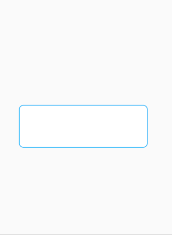

# ScalableEditText

A Scalable EditText library for Android, which can be scaled by touching and dragging the edges of the EditText.

## Getting Started

### Setting up the dependency
Add the library to your module ```build.gradle```
    
```
implementation 'com.sanjay.scalableedittext:scalableediteext:1.0.4'
```

## Demo App
To run the demo project, clone the repository and run it via Android Studio.

## Usage
### Adding directly in layout.xml
```
<com.sanjay.scalableedittext.ScalableEditText
        android:layout_width="300dp"
        android:layout_height="100dp"
        android:layout_gravity="center"
        android:background="@drawable/edittext_background"
        android:focusable="true"
        android:focusableInTouchMode="true"
        android:gravity="center_vertical|center_horizontal"
        android:inputType="textMultiLine|textNoSuggestions"
        android:isScrollContainer="false"
        android:maxLength="240"
        android:textColor="#000000"
        android:textSize="90sp" />
```
## License
```
Licensed under the Apache License, Version 2.0 (the "License");
you may not use this file except in compliance with the License.
You may obtain a copy of the License at

   http://www.apache.org/licenses/LICENSE-2.0

Unless required by applicable law or agreed to in writing, software
distributed under the License is distributed on an "AS IS" BASIS,
WITHOUT WARRANTIES OR CONDITIONS OF ANY KIND, either express or implied.
See the License for the specific language governing permissions and
limitations under the License.
```
